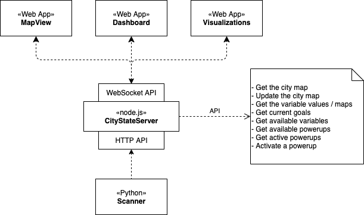

# future-mobility Architecture

This document describes the high level architecture of future-mobility. Inspired by [this article](https://matklad.github.io//2021/02/06/ARCHITECTURE.md.html).

## Project overview

The central component of the project is an application server that holds the state for the simulated
city. A computer vision component (on a separate repository) reads the layout of the physical city
and pushes it to the server. When the city layout changes, the server pushes updates to multiple 
clients that render the city and its state.

The application server is a node.js process that uses `express` and `ws` to provide both HTTP and
WebSocket endpoints to the clients.

Clients are web apps (SPAs) compiled using WebPack that can run on a regular compatible browser:

- city.html: Renders the city map.
- editor.html: Provides a city editor for use in development when the computer vision component is
  not available or practical.

### GitHub Pages

The repository is meant to be used with GitHub Pages to showcase features and allow running 
experiments. Hence, the client code is compiled and commited to the repository. The `index.html`
file is a stand-alone app that allows editing and visualizing the city without the use of a server,
and so can be used from GitHub Pages.

## Directories

- `art`: Source image files (Adobe Illustrator format, etc.)
- `assets`: Webpack places its compiled files here.
- `docs`: Documentation
- `server`: Code for the application server. It has its own `package.json` file. It uses some code
  files from the `src` directory, which enables the same code to be used in the server and the 
  clients (including the stand-alone demo client).
  - `server/test`: Test code and support files for testing the server.
- `src`: Client source code:
  - `src/html`: HTML templates for the different client apps.
  - `src/js`: Main source code for the clients and the model that runs in the server.
  - `src/sass`: SASS code for the clients.
- `static`: Static files (images mostly) that get included through WebPack.
- `vendor`: Web libraries used in the clients.

## Source code organization

Source code is in `src/js`. Classes are mentioned by their name but normally each class is stored
in a file with the same name in kebab-case.

There is one  **entry point per client**, they're named `main-*.js`. These files read the 
configuration, build the views by composing components as needed, and connect to the server.

The main model for the city is the `City` class. It uses a `Grid` to represent the city as a grid.
Both the server and clients create their own city model using the same class. Clients use the
`ServerSocketConnector` to connect to the server and receive updates to the layout, which they 
copy to their own city object.

The main view is `MapView`, which renders a city using PNGs to represent each tile. PIXI.js is
used for all views. `MapEditor` uses the same class, but adds a tool palette and various classes
to handle its functionality (these are in the `editor` subdirectory).

The `VariableView` renders variables that are calculated for each tile of the map.
